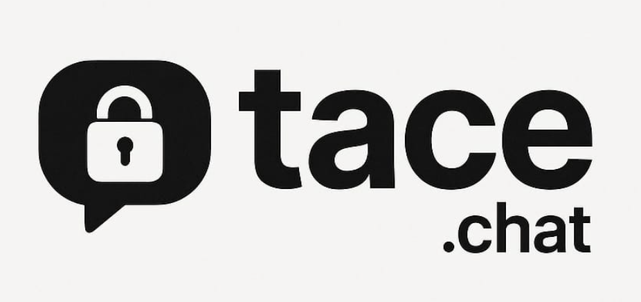

_Real privacy. Just you and the person you're talking to._

Private messaging the way it should be — no middlemen, no data collection, no compromises.

## Why tace.chat?

**🔐 End-to-end encrypted by default**
Every message is encrypted before it leaves your device. Only you and your recipient have the keys.

**🌍 Decentralized network**
No central servers to hack or shut down. Messages route through a network of independent nodes that can't read your conversations.

**🛠️ Completely open source**
Inspect the code, verify the security, contribute improvements. Transparency builds trust.

**🚀 Simple to use**
Secure messaging shouldn't require a computer science degree. Just open, connect, and chat.

## Getting started

1. **Visit [tace.chat](https://tace.chat)** — no downloads required
2. **Share your link** with someone you want to chat with
3. **Start talking** — everything is encrypted automatically

## Technical details

- **Encryption**: ChaCha20-Poly1305 with X25519 key exchange
- **Network**: Peer-to-peer with DHT-based routing
- **Privacy**: No logs, no metadata collection, no tracking
- **Compatibility**: Works in any modern browser

## Support the network

The network grows stronger with each node. Running a node is lightweight and helps preserve privacy for everyone.

> _Your node helps others talk in peace._

**[📚 Learn how to run a node →](RUNNING_A_NODE.md)**

### Why run a node?

- **Strengthen privacy** — More nodes make the network more resilient
- **Minimal resources** — Uses less than 100MB RAM and minimal bandwidth
- **Easy setup** — Deploy in minutes with Docker or our installer
- **No maintenance** — Nodes self-update and self-heal

## Contributing

We welcome contributions! Whether you're fixing bugs, adding features, or improving documentation.

Please visit [GitHub](https://github.com/nootr/tace.chat) to get started.

## Security

Found a security issue? Please report it privately to jorishartog@hotmail.com.

## Terms and Conditions

Please read our full [Terms and Conditions](TERMS_AND_CONDITIONS.md) and [LICENSE](LICENSE) before using tace.chat.

---

tace.chat is built with a strong commitment to privacy, autonomy, and free expression.
Please use it responsibly.
